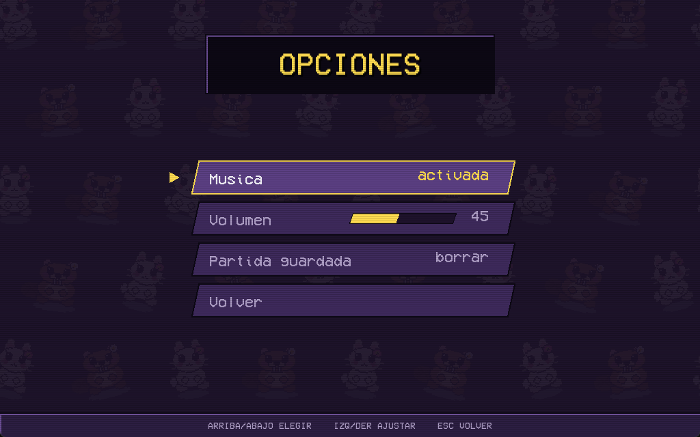
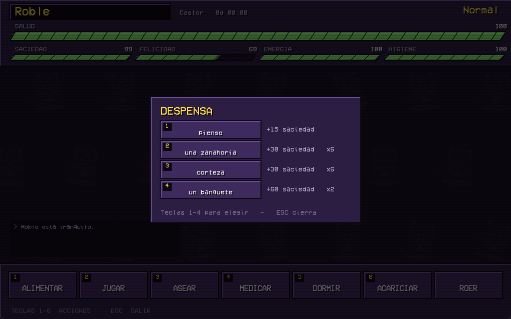
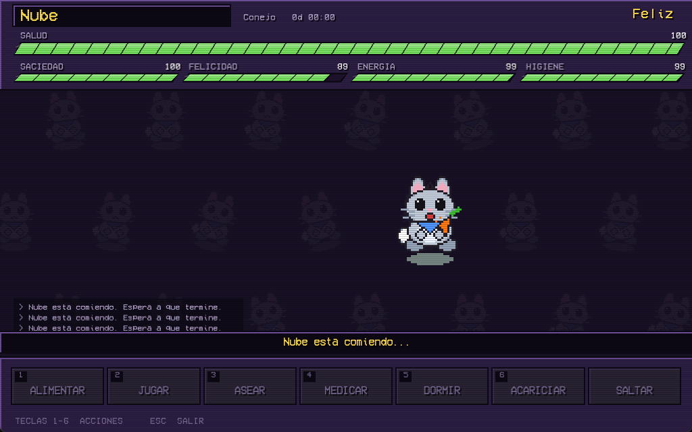
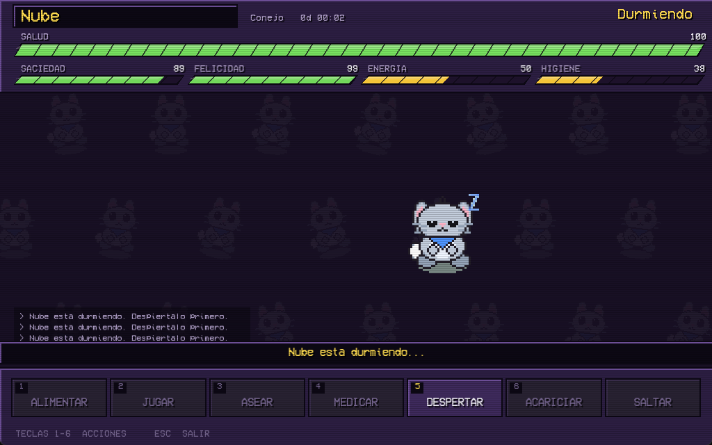
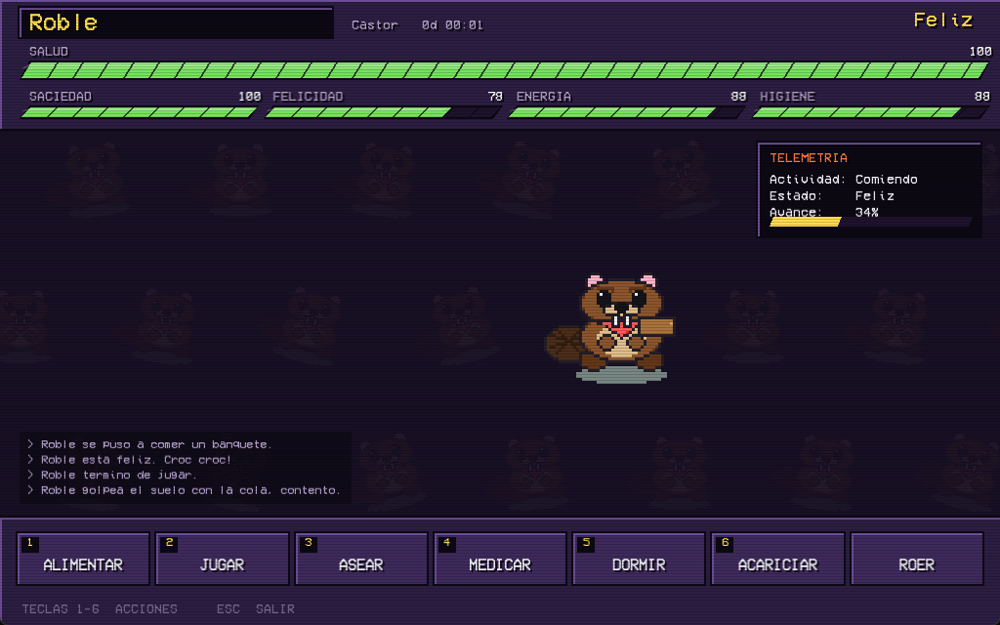

# VirtualPet

> Versión 1.2


## Descripción

**VirtualPet** es una mascota virtual al estilo Tamagotchi / Pou, desarrollada
en C++17 orientado a objetos con la biblioteca SFML. La mascota tiene cinco
necesidades que se van agotando con el tiempo y ocho estados por los que va
pasando según cómo la cuides: si la dejas sin comer se pone hambrienta, si no
duerme se agota, y si la descuidas lo suficiente enferma y muere.

El proyecto está pensado alrededor de una idea: **la lógica del juego no conoce
SFML**. Eso permite compilarla y probarla por separado, y es lo que sostiene
toda la estructura de clases.

## Características Principales

- **Ocho estados con transiciones por prioridad**: cada estado es una clase
  propia y decide él mismo a dónde puede pasar, sin un `if` gigante que crezca
  con el proyecto.
- **Dos especies y dos géneros**: conejo o castor, macho o hembra. Cada especie
  tiene sus propias tasas de desgaste, su sonido y una acción exclusiva; cada
  combinación de especie y género, su propia hoja de sprites.
- **Nombre libre**: el campo empieza vacío y no se puede empezar sin escribir uno.
- **Acciones progresivas y exclusivas**: comer, jugar, asear y medicar no son
  instantáneos. La mascota se pone a ello, la animación se repite y la barra
  sube poco a poco — y mientras dure **no acepta ninguna otra acción**. Un solo
  método, `Mascota::puede()`, decide qué se puede hacer en cada momento, y de
  ahí salen tanto el rechazo como los botones que se apagan.
- **Despensa con cuatro comidas**, cada una con su cantidad y sus raciones. Lo
  que alimenta decide también cuánto dura la animación de comer.
- **Ritmo pausado**: las barras tardan entre 9 y 17 minutos en vaciarse, según
  la especie. Es un juego de cuidar, no de vigilar.
- **Efectos cruzados entre necesidades**: la salud no baja sola, baja cuando
  descuidas la comida, la higiene o el ánimo. Y sube si cuidas bien.
- **Animación por hoja de sprites** descrita en un archivo de texto que se
  puede ajustar sin recompilar: doce animaciones por especie y género, entre
  estados (normal, feliz, hambrienta, durmiendo, jugando, enferma, muerta) y
  acciones (comer, bañarse, medicarse, mimos y la propia de cada especie), que
  se repiten mientras dure la acción.
- **Dibujo de respaldo**: las especies sin arte se dibujan con figuras
  geométricas, así que el juego siempre se ve.
- **Guardado automático** al salir, en un archivo de texto legible.
- **Admin_Menu**: menú de desarrollo para forzar cualquier estado, acelerar el
  reloj y encender una **telemetría** que dice qué está haciendo la mascota.

## Requisitos del Sistema

- Sistema Operativo: Windows 10/11 (64 bits)
- Memoria RAM: 512 MB
- Espacio en disco: 20 MB
- Dependencias: SFML 3.0 (incluida en el paquete de entrega)

## Instalación

### Para Usuarios

1. Descarga la carpeta de entrega y descomprímela donde prefieras.
2. Ejecuta `game.exe`.

La carpeta ya trae las DLL necesarias, así que no hace falta instalar nada.

### Para Desarrolladores

1. Clona este repositorio:

```bash
git clone https://github.com/EberGarza/Proyecto6P.git
```

2. Instala MSYS2 y, desde la consola **MSYS2 UCRT64**, las dependencias:

```bash
pacman -S mingw-w64-ucrt-x86_64-gcc mingw-w64-ucrt-x86_64-make mingw-w64-ucrt-x86_64-sfml
```

3. Añade `C:\msys64\ucrt64\bin` al `PATH` de Windows.

4. Compila y ejecuta:

```bash
cd Proyecto6P
mingw32-make run
```

> **Importante:** el juego busca la carpeta `assets/` con rutas relativas, así
> que hay que lanzarlo desde la raíz del proyecto.

## Controles

- **Ratón**:
  - Clic izquierdo: pulsar los botones de acción
- **Teclado**:
  - `1` a `6`: alimentar, jugar, asear, medicar, dormir, acariciar
  - Flechas: elegir especie y género en la pantalla de selección
  - `Enter`: confirmar en la pantalla de selección
  - `Escape`: cerrar el panel de desarrollo, o salir del juego guardando
  - `F1`: abrir y cerrar el Admin_Menu, una vez desbloqueado

### La interfaz del juego

La pantalla de partida está montada como el marcador de un juego de pelea de
recreativa, para que combine con el menú de inicio:

- **Chapa con el nombre** arriba a la izquierda, y el estado actual a la
  derecha, como el marcador de asalto.
- **Barra de SALUD** ancha cruzando la pantalla, y cuatro medidores menores
  debajo. La forma es un paralelogramo inclinado, con muescas que segmentan el
  nivel para leerlo sin mirar el número.
- **Rastro rojo.** Cuando un valor cae de golpe, un bloque rojo se queda atrás y
  baja después. Es el recurso que usan esos juegos para que un golpe se *vea*, y
  aquí sirve igual: si la mascota pierde salud de repente, se nota.
- **Cartel de estado.** Cada vez que la mascota cambia de estado aparece su
  nombre en grande en mitad del escenario, y **K.O.** cuando muere.
- **Botonera** con el número de atajo en cada botón, como un panel de control.
- **Líneas de barrido** sobre todo el juego, que imitan un monitor de tubo.

El fondo repite en mosaico a la propia mascota, compuesto en caliente desde su
hoja de sprites, igual que el menú de inicio.

## Estructura del Proyecto

```
Proyecto6P/
│
├── assets/              # Recursos del juego
│   ├── fonts/           # Fuentes tipográficas
│   ├── images/          # Una hoja de sprites por especie y género,
│   │                    #   con su archivo de recortes
│   │   ├── beta/        # Arte de versiones anteriores, sin usar
│   │   └── screenshots/ # Capturas para la documentación
│   └── sound/           # Música y efectos sonoros
│
├── bin/                 # Archivos ejecutables compilados
│
├── docs/                # Documentación
│   ├── Manual_Usuario.md      # Manual del usuario
│   ├── Manual_Programador.md  # Manual del programador
│   ├── diagrama_clases.puml   # Diagrama UML de la arquitectura
│   └── diagrama_estados.puml  # Diagrama de estados de la mascota
│
├── include/             # Archivos de cabecera (.hpp)
│
├── src/                 # Código fuente (.cpp)
│
└── Makefile             # Script de compilación
```

### Las dos capas

Aunque `include/` y `src/` son planos, el código está pensado en dos capas y
la separación se respeta con disciplina: **las clases de lógica no incluyen
SFML en ningún archivo**. Sólo la capa gráfica habla con la biblioteca, y la
dependencia va siempre en un sentido.

| Capa | Clases | Depende de |
|------|--------|------------|
| Lógica | `Mascota` y las especies, `Atributo`, `Estado`, `MaquinaEstados`, `TipoEstado`, `Objeto` y derivadas, `Inventario`, `FabricaMascotas`, `GestorGuardado`, `AdminMenu`, `Utilidades` | nada externo |
| Gráfica | `Juego`, `Pantalla` y derivadas, `RenderMascota` y derivadas, `VistaMascota`, `HojaSprites`, `Animacion`, `Hud`, `Boton`, `BarraAtributo`, `PanelAdmin`, `Tema`, `GestorRecursos`, `Music`, `MusicButton` | de la lógica y de SFML |

Si una clase de la primera columna necesitara incluir SFML, sería señal de que
está en la capa equivocada.

## Documentación

- [Manual del Usuario](./docs/Manual_Usuario.md) - Cómo jugar y cuidar a la mascota
- [Manual del Programador](./docs/Manual_Programador.md) - Arquitectura y decisiones de diseño
- [Diagrama de Clases](./docs/diagrama_clases.puml) - Las clases y sus relaciones
- [Diagrama de Estados](./docs/diagrama_estados.puml) - Los ocho estados y sus transiciones

## Desarrollo

### Compilación

El proyecto utiliza un Makefile para simplificar la compilación:

```bash
# Compilar el proyecto
mingw32-make

# Compilar y ejecutar
mingw32-make run

# Limpiar archivos compilados
mingw32-make clean
```

> Para entregar el ejecutable hay que copiar junto a `game.exe` las DLL de
> MinGW y SFML que están en `C:\msys64\ucrt64\bin`. Sin ellas Windows no lo
> arranca y el mensaje de error no explica gran cosa.

### Tecnologías utilizadas

- **Lenguaje**: C++17
- **Gráficos y audio**: SFML 3.0
- **Compilador**: MinGW-w64 GCC (entorno UCRT64)
- **Construcción**: Make
- **Documentación**: Markdown, PlantUML

## Capturas de pantalla










## Colaboradores

- [EberOmarGarzaFuentes] - Desarrollo principal

## Licencia

© 2026 [Inei-Zone] - Todos los derechos reservados

## Agradecimientos

- A la biblioteca SFML y sus desarrolladores
- A la universidad y profesores que guiaron este proyecto

---

> "Una mascota virtual es una excusa muy buena para practicar herencia,
> polimorfismo y máquinas de estados."
