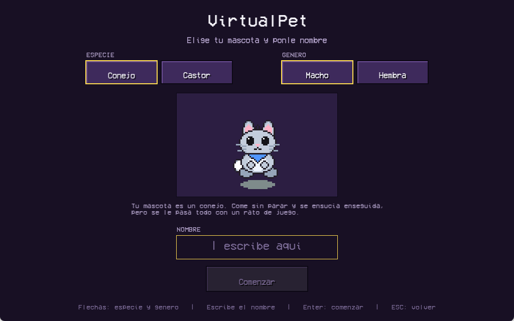

# Manual del Usuario

## Qué es VirtualPet

Una mascota virtual que vive en tu ordenador y depende de que la cuides.
Puedes tener un conejo o un castor, macho o hembra, y ponerle el nombre que
quieras. Tiene cinco necesidades que se van agotando solas con el tiempo, y su
estado de ánimo y su salud dependen de lo bien que las atiendas. Si la
descuidas lo suficiente, se enferma. Y si la enfermedad no se trata, muere.

## Cómo empezar

Al abrir el juego aparece el menú principal, con música de fondo.

Muévete por las opciones con las flechas `↑` y `↓`, y confirma con `Enter`:

- **Jugar** lleva a la pantalla de selección.
- **Opciones** abre los ajustes.
- **Salir** cierra el juego.

La tecla `M` silencia y reactiva la música en cualquier momento; el altavoz de
la esquina indica si está sonando.

### Opciones

- **Música**: enciende y apaga el sonido.
- **Volumen**: se ajusta con `←` y `→`.
- **Borrar partida**: elimina la mascota guardada. No se puede deshacer.
- **Volver**: regresa al menú. También sirve `Escape`.

### Elegir la mascota

1. **Elige la especie**: conejo o castor. Con el ratón, o con las flechas
   `←` y `→`.
2. **Elige si es macho o hembra**, con el ratón o con `↑` y `↓`. Cada
   combinación tiene su propio dibujo, y la vista previa se actualiza al
   momento.
3. **Escribe el nombre** con el teclado. Empieza vacío a propósito, para que
   pongas el que quieras. Se borra con retroceso y admite hasta 14 caracteres.
4. Pulsa **Comenzar** o la tecla `Enter`.

> El botón **Comenzar** está apagado mientras no escribas un nombre. Sin nombre
> no se empieza.

Si ya habías jugado antes, arriba a la derecha aparece **Continuar partida**,
que recupera la mascota tal y como la dejaste.

## Las cinco barras

Todas siguen la misma regla: **cuanto más llena, mejor**.

| Barra | Vacía significa | Se recupera con |
|-------|-----------------|-----------------|
| Saciedad | Está famélica | Alimentar |
| Felicidad | Está deprimida | Jugar, acariciar |
| Energía | Está agotada | Dormir |
| Higiene | Está sucia | Asear |
| Salud | Se muere | Medicar |

La **salud es distinta a las demás**: no baja sola. Baja cuando la saciedad, la
higiene o la felicidad llegan a niveles críticos, y vuelve a subir por su cuenta
si la mascota está bien cuidada. Es decir, descuidar una cosa acaba pagándose en
otra. Por eso la salud tiene su propia barra, ancha y cruzando la pantalla,
mientras las otras cuatro van más pequeñas debajo.

Las barras están cortadas en muescas, como los medidores de vida de un juego de
pelea: así se ve de un vistazo cuánto queda sin leer el número. Y cuando un
valor **cae de golpe**, un bloque rojo se queda atrás y baja después, para que
el golpe se note.

El color avisa por sí solo: **verde** si va bien, **ámbar** cuando conviene
atenderla y **rojo** cuando es urgente.

## Las acciones

Los botones de abajo, o las teclas `1` a `6`:

| Botón | Tecla | Qué hace |
|-------|-------|----------|
| Alimentar | `1` | Sube la saciedad. Ensucia un poco |
| Jugar | `2` | Sube mucho el ánimo, gasta energía y da hambre |
| Asear | `3` | Sube la higiene. A la mascota no le hace gracia |
| Medicar | `4` | Sube la salud. Sabe mal, así que baja el ánimo |
| Dormir | `5` | Se duerme y recupera energía. Vuelve a pulsar para despertarla |
| Acariciar | `6` | Sube un poco el ánimo, gratis |

El **último botón cambia según la especie**: el conejo puede *Saltar*, que le
sube mucho el ánimo a cambio de energía y de ensuciarse; el castor puede
*Roer*, que le anima y le abre el apetito.

Al pulsar **Asear** la mascota se baña: aparece llena de espuma unos segundos y
después vuelve a lo que estaba haciendo.

Abajo a la izquierda, la **bitácora** va contando lo que pasa como un teletipo:
qué comió, cuándo se durmió, cuándo se puso enferma.

## Los ocho estados

La mascota está siempre en uno de estos estados. El nombre del estado aparece
arriba a la derecha, y cada vez que cambia se anuncia en grande en mitad de la
pantalla.

| Estado | Cuándo ocurre |
|--------|---------------|
| **Normal** | Todo en orden |
| **Feliz** | La felicidad pasa de 80 |
| **Hambrienta** | La saciedad baja de 20 |
| **Cansada** | La energía baja de 20 |
| **Durmiendo** | Le has dicho que duerma, o se ha desmayado de agotamiento |
| **Enferma** | La salud baja de 30. Sólo mejora con medicina |
| **Jugando** | Estado temporal de unos segundos |
| **Muerta** | La salud llegó a cero. Se anuncia con un **K.O.** y no hay vuelta atrás |

Cuando hay varias necesidades a la vez, mandan por este orden: **muerte,
enfermedad, hambre, cansancio**.

Mientras duerme **no acepta interacciones**. Puedes despertarla, pero si lo
haces antes de tiempo se enfada y pierde ánimo.

## Guardar la partida

El juego **guarda solo al cerrarse** con `Escape` o con la X de la ventana. La
partida queda en un archivo `partida.txt` junto al ejecutable, en texto plano y
legible.

Al volver a abrir, la pantalla de selección ofrece continuar donde lo dejaste.

## Problemas frecuentes

**El juego no arranca y Windows no dice por qué.**
Faltan las DLL. La carpeta de entrega tiene que llevar los archivos `.dll` junto
a `game.exe`. Si compilaste tú, cópialas de `C:\msys64\ucrt64\bin`.

**Arranca pero se ve sin la mascota, o avisa de la fuente.**
Estás ejecutándolo desde otra carpeta. El juego busca `assets/` con rutas
relativas, así que hay que lanzarlo desde la raíz del proyecto.

**Las letras no se ven como en las capturas.**
Falta la tipografía. El juego usa `VCR_OSD_MONO_1.001.ttf`, que está en
`assets/fonts/`; si no la encuentra, tira de una fuente del sistema. No afecta
a nada más.

**No se oye la música.**
Mira en **Opciones** que esté encendida y que el volumen no esté a cero. La
tecla `M` también la silencia desde el menú.

**Se me murió la mascota.**
No se puede revivir desde el juego. Entra en **Opciones → Borrar partida** y
empieza otra.
